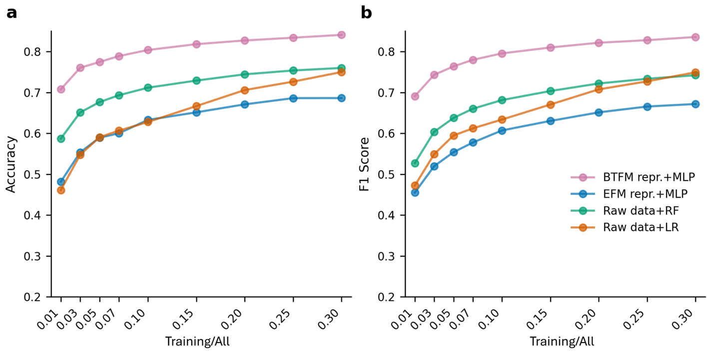
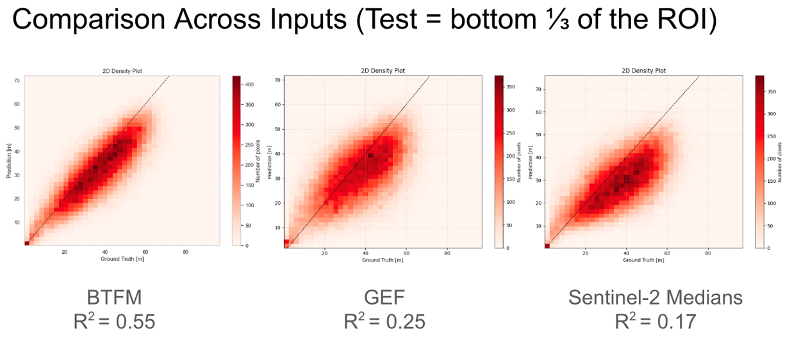
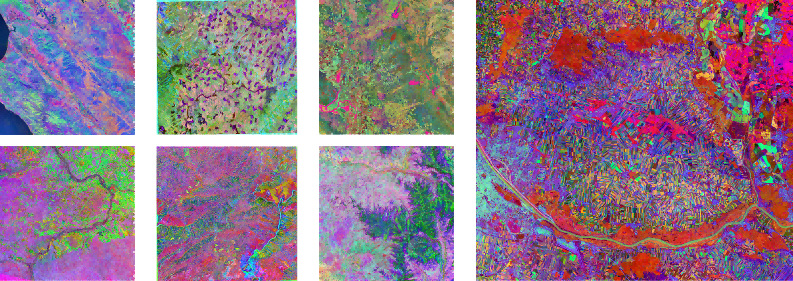
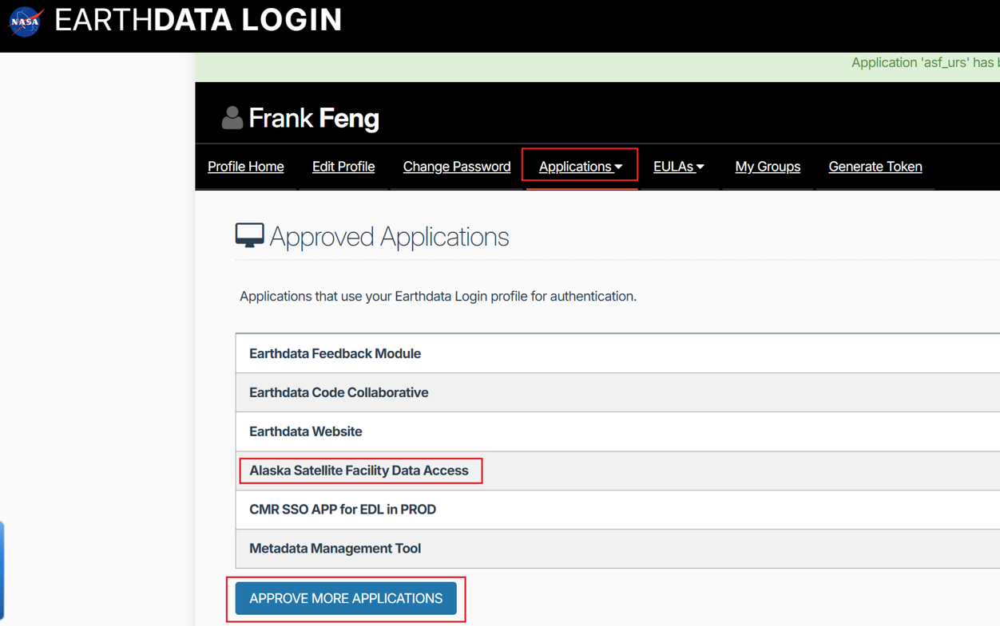

# Barlow Twins Foundation Model (BTFM) For Earth Observation


**Alpha testing, for Cambridge internal users only**

**We strongly recommend that you quickly review the entire tutorial before running the pipeline.**

## Table of Contents

- [Introduction](#introduction)
- [Initial Results](#initial-results)
    - [Land Classification](#land-classification)
    - [Canopy Height Prediction](#canopy-height-prediction)
    - [Representation Visualization](#representation-visualization)
- [Hardware Requirements](#hardware-requirements)
    - [1. Storage Requirements](#1-storage-requirements)
    - [2. Memory Requirements](#2-memory-requirements)
    - [3. CPU and GPU](#3-cpu-and-gpu)
    - [4. Operating System](#4-operating-system)
- [Data Preprocessing](#data-preprocessing)
    - [Overview](#overview)
    - [Download Source Code](#download-source-code)
    - [Install Docker](#install-docker)
    - [Account Registration](#account-registration)
    - [Script Configuration](#script-configuration)
    - [Running the Pipeline](#running-the-pipeline)
    - [Known Issues](#known-issues)
- [Inference](#inference)
    - [Overview](#overview-1)
    - [Preparation](#preparation)
    - [Configure Bash Script](#configure-bash-script)
    - [Start Inference](#start-inference)
    - [Stitch Final Representation Map](#stitch-final-representation-map)
- [Additional Notes](#additional-notes)

## Introduction

BTFM is a foundation model for Earth observation that processes Sentinel-1 and Sentinel-2 satellite data to generate representation (embedding) maps. It compresses a full year of Sentinel-1 and Sentinel-2 data and learns useful temporal-spectral features.

## Initial Results

We applied the representations obtained from BTFM to several downstream tasks and compared them with the current state-of-the-art foundation model: Google DeepMind's Embedding Fields Model (EFM). We found that BTFM performed better in the tested downstream tasks.

### Land Classification

We evaluated the model's performance in a classification task on an unbalanced Austrian crop dataset containing 17 classes. The results are shown below:



Random Forest and Logistic Regression are baselines, using all Sentinel-1 and Sentinel-2 data from 2022 (with 1000+ features). BTFM has 128 features, while EFM has 64.

### Canopy Height Prediction

We evaluated the model's performance in a regression task (canopy height prediction) in a forest from Borneo. The results are shown in the figure below:



(GEF refers to Google's EFM.)

### Representation Visualization

Below are some visualization results of the BTFM representation map (using the first three channels as RGB):



## Hardware Requirements

### 1. Storage Requirements

Running this pipeline requires substantial storage space. Although the pipeline cleans up some intermediate files after processing, the downloaded raw Sentinel-2 and Sentinel-1 files will still occupy considerable disk space. For example, processing a 100km×100km area from 2022 to output a BTFM Representation map (10m resolution) requires at least 1TB of storage.

### 2. Memory Requirements

When processing raw Sentinel-1 data, we use ESA SNAP with multi-threading to accelerate processing. According to our estimates, at 10m resolution, each thread may use up to 100GB of memory, with the pipeline using 4 threads by default. Therefore, we recommend having at least 512GB of RAM. If memory is insufficient, SNAP will not throw OOM errors but will run more slowly. We still recommend running on a machine with sufficient memory.

### 3. CPU and GPU

The pipeline has no strict requirements for CPU and GPU, but more CPU cores and more powerful GPUs can significantly speed up inference. When processing a 110km×110km area from 2022, our tests using a 128-core CPU and a single NVIDIA A30 GPU for inference (CPU and GPU each handling 50% of the inference) took approximately 10 hours to complete.

### 4. Operating System

We have only tested on Linux and are unsure if the pipeline runs properly on other operating systems.

## Data Preprocessing

### Overview

In this step, we stack a full year of Sentinel-1 and Sentinel-2 data along the time dimension to generate a composite. For Sentinel-2, the composite shape is (T,H,W,B), where T is the number of valid observations in that year, and B is the number of bands (we selected 10 bands). For Sentinel-1, we extracted both ascending and descending orbit data. Taking the ascending orbit as an example, the composite shape is (T',H,W,B'), where T' is the number of valid ascending observations in that year, and B' is 2 because we only obtain VV and VH bands.

The pipeline uses multiple geographic processing packages and software such as GDAL and ESA SNAP, which can be painful to configure. Therefore, we've packaged all the necessary environments for data preprocessing into a Docker image, eliminating complex environment setup. For those unfamiliar with Docker, don't worry - we'll provide complete steps on how to download and use our pre-built image.

Currently, our pipeline only accepts TIFF format input, and the resolution must be 10m. For valid ROI areas within the TIFF, the value is 1; otherwise, it's 0. If you only have a shapefile, that's fine too - we provide a `convert_shp_to_tiff.py` script.

### Download Source Code

First, create an empty working directory:

```bash
mkdir btfm_project
cd btfm_project
git clone https://github.com/FrankFeng-23/btfm_project.git
```

For easier pipeline operation, we recommend placing the data output directory at the same level as `btfm_infer` and `btfm_preprocessing`:

```
btfm_project
 ┣ btfm_infer
 ┣ btfm_preprocessing
 ┣ my_data
   ┣ roi.shp (your shapefile)
   ┗ roi.tiff (we recommend generating this using convert_shp_to_tiff.py)
```

The `roi.tiff` can be generated using `convert_shp_to_tiff.py` located in `btfm_preprocessing/convert_shp_to_tiff.py`. To use it, simply specify the path to your shapefile in the main function, and it will output a TIFF with the same name in the same directory. (We assume you'll use your own Python environment; if any libraries are missing, please install them via pip.)

### Install Docker

As mentioned earlier, we provide a Docker image for data preprocessing, which includes a pre-configured Python environment with GDAL and SNAP installed. First, ensure Docker is installed on your system.

You can check using this command:
```bash
docker --version
```

If not installed, you can install it using:
```bash
# For Ubuntu/Debian
sudo apt-get update
sudo apt-get install docker-ce docker-ce-cli containerd.io

# For CentOS
sudo yum install docker-ce docker-ce-cli containerd.io

# Start Docker service
sudo systemctl start docker
```

Note: On some clusters, installation may be restricted. In such cases, please contact the administrator to determine the best installation/usage method.

Once Docker is ready, you can download our pre-built image using:
```bash
docker pull frankfeng1223/snap-gdal-python:v3
```

You can check if it was successfully downloaded with:
```bash
docker images | grep snap-gdal-python
```

### Account Registration

When downloading raw Sentinel-1 data, we use the Alaska Satellite Facility (ASF) service, which requires account registration. First, go to https://urs.earthdata.nasa.gov/home.

After registering, go to the Applications page, click "Approve more applications", and ensure that "Alaska Satellite Facility Data Access" is enabled.



After that, you need to open the pipeline's `btfm_preprocessing/main_pipeline.sh` and modify the following content with your username and password:
```bash
S1_DOWNLOAD_USERNAME="your_username"
S1_DOWNLOAD_PASSWORD="your_password"
```

### Script Configuration

In the previous step, you opened `btfm_preprocessing/main_pipeline.sh`. There is another line that needs to be modified:
```bash
BASE_DATA_DIR="absolute_path_to_my_data"
```

Replace the placeholder with the absolute path to your previously created `my_data` folder. For example: `/maps/usr/btfm_project/my_data`. We highly recommend you to use the absolute path here.

### Running the Pipeline

Now that everything is ready, you can give execution permission to the bash script in the `btfm_preprocessing` directory:

First enter the `btfm_preprocessing` directory:
```bash
cd ./btfm_preprocessing
```

Then do:
```bash
chmod +x main_pipeline.sh
```

Then run it with:
```bash
bash main_pipeline.sh {tiff} {s2_start_time} {s2_end_time} {s1_start_time} {s1_end_time} {downsample_rate}
```

The meaning of each parameter is as follows:
- tiff: The input TIFF file for downstream tasks, which is the `my_data/roi.tiff` you generated earlier
- s2_start_time: Start date for Sentinel-2 data
- s2_end_time: End date for Sentinel-2 data
- s1_start_time: Start date for Sentinel-1 data
- s1_end_time: End date for Sentinel-1 data
- downsample_rate: Downsampling rate, currently only supports 1 (no downsampling, 10m resolution)

For example, if you want to get the composite for a specific ROI in 2022, you can run:
```bash
bash main_pipeline.sh /maps/usr/btfm_project/my_data/roi.tiff 2022-01-01 2023-01-01 2022-01-01 2023-01-01 1
```

### Known Issues

The current pipeline is still in alpha testing. We've found that many warnings and errors appear during execution, especially when using SNAP and GDAL. Fortunately, our testing has shown that these errors do not affect the results and do not prevent the program from continuing. The currently known errors are mainly as follows, concentrated during Sentinel-1 processing (because SNAP's Python plugin itself may have many issues):

```
ERROR 1: libpq.so.5: cannot open shared object file: No such file or directory
```

```
A descriptor is already registered against the name "org.geotools.ColorInversion" under registry mode "rendered"
Error while parsing JAI registry file "file:/opt/snap/snap/modules/ext/org.esa.snap.snap-core/org-jaitools/jt-zonalstats.jar!/META-INF/registryFile.jai" :
Error in registry file at line number #4
```

```
#
# A fatal error has been detected by the Java Runtime Environment:
#
#  SIGSEGV (0xb) at pc=0x00007594690013fe, pid=1, tid=1
#
# JRE version: OpenJDK Runtime Environment (11.0.19+7) (build 11.0.19+7-LTS)
# Java VM: OpenJDK 64-Bit Server VM (11.0.19+7-LTS, mixed mode, tiered, g1 gc, linux-amd64)
# Problematic frame:
# C  [libc.so.6+0xa53fe]  free+0x1e
#
# Core dump will be written. Default location: /data/core
#
# An error report file with more information is saved as:
# /data/hs_err_pid1.log
malloc_consolidate(): unaligned fastbin chunk detected
```

```
Command failed with status 127: docker run --rm -v xxxxxx
```

```
Warning 1: TIFFReadDirectory:Sum of Photometric type-related color channels and ExtraSamples doesn't match SamplesPerPixel. Defining non-color channels as ExtraSamples.
```

```
ERROR 1: PROJ: internal_proj_identify: /usr/share/proj/proj.db contains DATABASE.LAYOUT.VERSION.MINOR = 2 whereas a number >= 3 is expected. It comes from another PROJ installation.
```

As long as the bash script doesn't automatically exit but continues to run, it proves that these errors are not fatal.

## Inference

### Overview

Once the data preprocessing is complete, we can start inference. Before proceeding, please check if there are subfolders in the `my_data/retiled_d_pixel` folder like:
```
retiled_d_pixel
 ┣ 0_3500_500_4000
 ┣ 0_4000_500_4500
 ┣ 0_4500_500_5000
 ┣ 0_5000_500_5500
 ┣ 0_5500_500_6000
 ┣ 0_6000_500_6500
```

Each subfolder should contain the following files:
```
0_3500_500_4000
 ┣ bands.npy
 ┣ doys.npy
 ┣ masks.npy
 ┣ roi.tiff
 ┣ sar_ascending.npy
 ┣ sar_ascending_doy.npy
 ┣ sar_descending.npy
 ┗ sar_descending_doy.npy
```

If these files exist, you can start inference. Otherwise, check if the first step completed successfully.

Inference requires PyTorch. Since each system may have slightly different CUDA versions, we can't provide a Docker-encapsulated Python environment like we did for data preprocessing. Fortunately, the Python environment for inference is much simpler to configure than for data preprocessing, as it doesn't use geographic processing packages like GDAL or SNAP.

### Preparation

First, we need to prepare a Python environment. Let's assume we create a new virtual environment (if you already have a commonly used environment with PyTorch, you can use that). Create a new virtual environment with:

```bash
# Using conda
conda create -n btfm_env python=3.9
conda activate btfm_env

# Or using venv
python -m venv btfm_env
source btfm_env/bin/activate
```

Then install the required packages:

```bash
pip install numpy tqdm joblib psutil rasterio
```

Finally, install PyTorch. First, check your system's CUDA version:

```bash
nvidia-smi
```

Then visit https://pytorch.org/ and select the appropriate version to install based on your CUDA version, for example:

```bash
pip install torch torchvision torchaudio --index-url https://download.pytorch.org/whl/cu128
```

Next, download the model weights from [Google Drive](https://drive.google.com/drive/folders/18RPptbUkCIgUfw1aMdMeOrFML_ZVMszn?usp=sharing) (only Cambridge members have access) and place the `.pt` file in the `btfm_infer/checkpoints` directory:

```
checkpoints
 ┗ best_model_fsdp_20250427_084307.pt
```

### Configure Bash Script

To simplify inference configuration, we provide `btfm_infer/infer_all_tiles.sh`. You only need to edit a few parameters:

a. Base data directory:
```bash
BASE_DATA_DIR="your_data_directory"
```
This is your data storage folder, the same as `BASE_DATA_DIR` in the previous bash, e.g., `/maps/usr/btfm_project/my_data`

b. Python environment:
```bash
export PYTHON_ENV="your_python_path"
```
Write the absolute path to your Python environment here, e.g., `/home/user/anaconda3/envs/btfm_env/bin/python`

c. CPU/GPU split:
```bash
CPU_GPU_SPLIT="1:1"  # Format: CPU:GPU ratio
```
The script supports simultaneous inference using both CPU and GPU. This ratio specifies the proportion of `retiled_patches` each device will handle. Default is 1:1 (even split). For GPU-only inference, set to 0:1.

d. CPU Related Settings

```bash
MAX_CONCURRENT_PROCESSES_CPU=20
```
Maximum number of CPU processes for tile inference. For example, if set to 20, it will process 20 tiles simultaneously.

```bash
AVAILABLE_CORES=$((TOTAL_CPU_CORES / 2)) # Use 50% of the cores
```
Number of CPU cores to use. Please modify this value if necessary to avoid consuming too many CPU resources!

e. GPU Related Settings:
```bash
MAX_CONCURRENT_PROCESSES_GPU=1
```
Maximum number of GPU processes for inference. If the system has only 1 GPU, set this to 1.

```bash
GPU_BATCH_SIZE=1024  # Larger for GPU, if this takes too much memory, reduce it
```
Number of samples to process at once during PyTorch inference. If this value consumes too much GPU memory or causes an OOM error on the GPU, please reduce it accordingly.

f. Other Settings
There are other parameters available for configuration. Please adjust them as needed.

### Start Inference

Once everything is ready, navigate to the `btfm_infer` folder:

```bash
cd btfm_infer
```

Then give permission to `infer_all_tiles.sh`:

```bash
chmod +x infer_all_tiles.sh
```

Then run it:

```bash
bash infer_all_tiles.sh
```

If successful, you should see logs like:

```
(base) zf281@daintree:/scratch/zf281/btfm_project/btfm_infer$ bash infer_all_tiles.sh
[INFO] Total CPU cores: 256, Using: 192
[INFO] CPU:GPU split ratio = 1:1 (total: 2)

==== SETUP DIRECTORIES ====
[SUCCESS] Created necessary directories

==== SCANNING TILES ====
[INFO] Tile directory: /scratch/zf281/jovana/retiled_d_pixel
[INFO] Output directory: /scratch/zf281/jovana/representation_retiled
[SUCCESS] Found 226 tiles total
[INFO] Sample tiles:
  - 0_3500_500_4000
  - 0_4000_500_4500
  - 0_4500_500_5000
  - ...
```

At the same time, a `logs` folder will be generated in the `btfm_infer` folder with more detailed logging for each CPU and GPU process.

### Stitch Final Representation Map

Inference usually takes a long time, depending on your ROI size and hardware performance. Once completed, you can find many `.npy` files in `my_data/representation_retiled`:

```
representation_retiled
 ┣ 0_3500_500_4000.npy
 ┣ 0_4000_500_4500.npy
 ┣ 0_4500_500_5000.npy
 ┣ 0_5000_500_5500.npy
 ┣ 0_5500_500_6000.npy
 ┣ 0_6000_500_6500.npy
 ┣ 0_6500_500_7000.npy
 ┣ 0_7000_500_7500.npy
 ┣ 1000_0_1500_500.npy
 ┣ 1000_1000_1500_1500.npy
 ┣ 1000_1500_1500_2000.npy
 ┣ 1000_2000_1500_2500.npy
```

The final step is to stitch them together using `btfm_infer/stitch_tiled_representation.py`:

```bash
python stitch_tiled_representation.py \
--d_pixel_retiled_path /path/to/d_pixel_retiled \
--representation_retiled_path /path/to/representation_retiled \
--downstream_tiff /path/to/downstream.tiff \
--out_dir /path/to/output_directory
```

For example:

```bash
python stitch_tiled_representation.py \
--d_pixel_retiled_path /maps/usr/btfm_project/my_data/d_pixel_retiled \
--representation_retiled_path /maps/usr/btfm_project/my_data/representation_retiled \
--downstream_tiff /maps/usr/btfm_project/my_data/downstream.tiff \
--out_dir /maps/usr/btfm_project/my_data
```

Finally, you'll get a stitched representation map in the `my_data` directory with the shape (H,W,128), where H and W match your initial `roi.tiff`. The representation map is a NumPy array. If you want to convert it to TIFF for viewing in software like QGIS, you can use the `btfm_infer/convert_npy2tiff.py` script. Just modify the main function with:

```python
npy_path = "/maps/usr/btfm_project/my_data/stitched_representation.npy"  # Change to the actual npy file path
ref_tiff_path = "/maps/usr/btfm_project/my_data/roi.tiff"  # Change to the actual reference tiff file path
out_dir = "/maps/usr/btfm_project/my_data/"  # Change to the actual output directory
```

## Additional Notes

Although generating a valid BTFM representation map requires specifying a full year time window, we strongly recommend testing the entire pipeline with a small time window (e.g., 1 month) before formal execution:

```bash
bash main_pipeline.sh /path/to/downstream.tiff 2021-01-01 2021-02-01 2021-01-01 2021-02-01 1
```

Since Sentinel-2 data has only been available since 2017, the current pipeline only supports collecting data from 2017-2024.